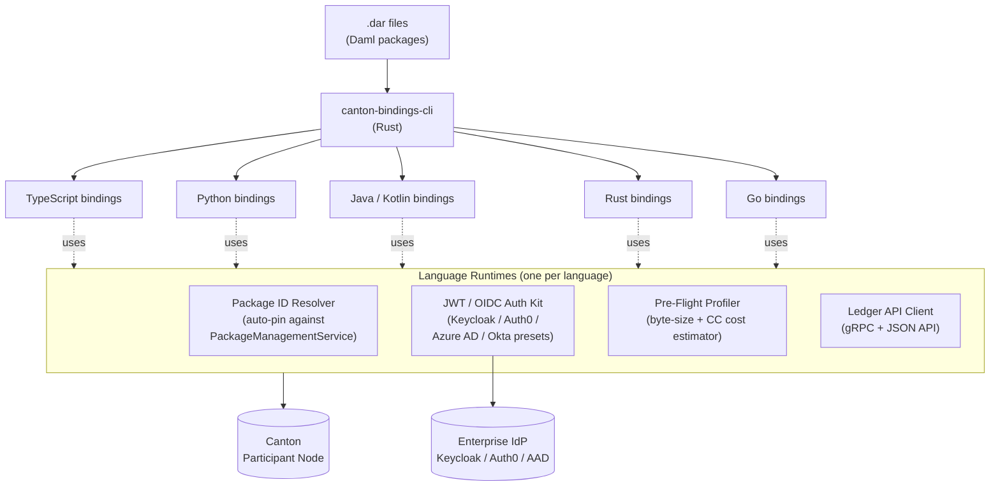
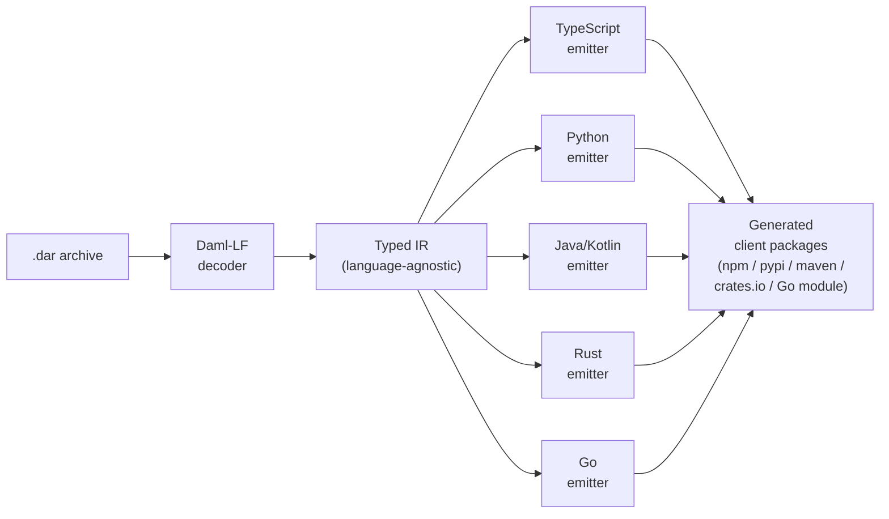
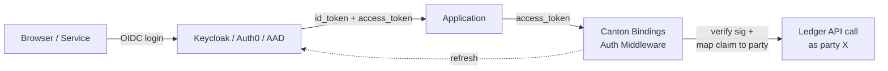

# Canton Bindings — Design Document (v0.1)

**A multi-language typed SDK, JWT/OIDC auth framework, and pre-flight transaction profiler for the Canton Network.**

Status: Draft for Canton Development Fund pre-PR review
Last updated: May 21, 2026

---

## 1. Problem

The Canton Foundation's Q1 2026 Developer Experience and Tooling Survey (41 respondents) identified three concrete, repeatedly-cited friction points that no project in the current Development Fund pipeline addresses:

1. **"Typed Client SDK & Code Generator: Developers currently spend days manually extracting hash strings from compiled files (.dar) and hardcoding them into their frontends."** Today, only `daml codegen js` ships officially. Teams building backends in Python, Java, Kotlin, Rust, or Go either hand-write gRPC clients against the Ledger API or maintain bespoke wrappers around the JSON API.

2. **"They also struggle significantly with implementing JWT authentication middleware, which is a repeated friction point for 'Hybrid' and 'TradFi' teams."** 83% of survey respondents identify as TradFi or Hybrid. These teams use enterprise identity (Keycloak, Auth0, Azure AD, Okta) and have to assemble JWT handling, signature verification, party-scoping, and token refresh from scratch in every language they ship.

3. **"Pre-Flight Resource & Cost Profiler: Developers often deploy 'blindly,' only discovering that their transactions are too large (hitting byte-size limits) or too expensive after they fail in a testnet or production environment."** No tool today gives a Canton developer a cost estimate before submission.

These three problems share a common shape: they all live in the **application runtime layer** between the dev loop (Cantool, dpm, Canton IDE) and the protocol (Splice, Canton core). That layer is currently empty.

## 2. Scope and non-goals

### In scope

| Component | Description |
|---|---|
| `canton-bindings-cli` | A codegen binary (Rust) that consumes `.dar` files and emits idiomatic, typed client code for five target languages |
| Language runtimes | Thin runtime libraries per language that wrap gRPC Ledger API + HTTP JSON API and consume the generated types |
| Package ID Resolver | A runtime component that auto-discovers and pins `.dar` package IDs against a participant's `PackageManagementService`, eliminating hardcoded hashes |
| JWT/OIDC Auth Kit | Per-language middleware with first-class presets for Keycloak, Auth0, Azure AD, and Okta — including party-claim mapping and token refresh |
| Pre-Flight Profiler | A library call that estimates serialized transaction byte size and Canton Coin cost before a `submit` |
| Cantool plugin | A `cantool-bindings` plugin that registers `cantool bindings gen <lang>` for users of Eric Mann's CLI |

### Target languages (priority order)

1. **TypeScript** (parity with `daml codegen js`, plus runtime resolver + JWT)
2. **Python** (highest demand from TradFi backends and data/ML teams)
3. **Java / Kotlin** (enterprise JVM teams — DTCC, Goldman, BNY adjacent)
4. **Rust** (high-performance services, infra integrations)
5. **Go** (cloud-native infra teams — aligns with Cantool's own language choice)

### Explicitly out of scope (to keep us focused)

- Local node orchestration → that's Cantool / cn-quickstart
- Visual debugging → that's CantonTrace
- Wallet abstraction / signing → that's PartyLayer / Wallet Gateway
- Block explorer / indexing → that's Cantonscan / ccview / The Tie
- Daml language tooling (LSP, formatter) → that's DA / community

This is deliberately a "complete the runtime layer" proposal — not a platform play.

## 3. Architecture

### 3.1 System overview



### 3.2 Codegen pipeline



The IR layer matters: it lets each language emitter ship idiomatic code (Python dataclasses, Rust enums, Kotlin sealed classes) rather than a lowest-common-denominator translation.

### 3.3 Runtime Package ID Resolver

The single most-cited integration pain. Today, a TS frontend that wants to call `Iou.transfer` has to know the SHA-256 package hash for the Iou template and hardcode it. When the .dar is recompiled, every frontend breaks until hashes are manually updated. Our resolver:

1. At app startup, queries the participant's `PackageManagementService.ListKnownPackages`
2. Matches discovered package IDs against the package metadata (`name`, `version`) baked into generated code at codegen time
3. Pins the resolution and caches in-process; supports version-pinning policy (`exact`, `compatible`, `latest`)
4. Surfaces clear errors when expected packages aren't uploaded yet
5. Exposes a refresh hook for hot-reloading after upgrades

### 3.4 JWT / OIDC Auth Kit



Per-language middleware ships with:
- JWK fetching and signature verification
- Configurable claim-to-party mapping (e.g. `email → ledger party`, `groups[] → readAs/actAs`)
- Token refresh and rotation
- Pre-built adapters for Keycloak (matches `cn-quickstart`'s OAuth2 mode), Auth0, Azure AD, Okta
- Express / FastAPI / Spring / Actix / Gin integrations

### 3.5 Pre-Flight Profiler

A pure function that takes a command and returns a `TransactionEstimate`:

```python
estimate = profiler.estimate(commands=[transfer_cmd], party=alice)
# TransactionEstimate(
#   serialized_bytes=14_822,
#   estimated_cc_cost=0.0042,
#   fits_under_byte_limit=True,
#   warnings=["fetched contract Iou:abc... is large"]
# )
```

Implementation strategy: build the same proto wire-format that the participant would serialize, run it through the same size accounting, apply published CC cost coefficients. No network call required for estimation.

## 4. Why this is the right bet for the Development Fund

### 4.1 Alignment with CIP-0082

CIP-0082 explicitly funds "dev tools, security, audits, reference implementations, and critical infra." Canton Bindings is squarely a dev tool **and** critical infra — every Canton dApp that talks to a participant from a non-JS language is reinventing this code today.

### 4.2 Alignment with the Foundation's own survey

| Survey item | This proposal |
|---|---|
| "Typed Client SDK & Code Generator" — listed in Magic Wand Wishlist | M1–M3 deliver it for 5 languages |
| "JWT authentication middleware" — called out as TradFi friction | M1–M3 ship presets for the 4 most-used enterprise IdPs |
| "Pre-Flight Resource & Cost Profiler" — listed in Additional Opportunities | M3 ships it as a library |

### 4.3 Complementary, not competitive

| Existing project | Their lane | Our lane |
|---|---|---|
| Cantool (#77) | Local dev loop CLI: init, build, test, dev, env | Application runtime: SDKs, auth, profiling |
| CantonTrace (#185) | Visual debugger, runtime tracing | Type-safe client construction & auth |
| PartyLayer (#9), Wallet Gateway (#109) | End-user wallet UX, signing services | Server-side SDK + machine-to-machine auth |
| `dpm` (DA) | Daml package compilation & deps | Multi-language *client* package generation |
| `daml codegen js` (DA) | TypeScript only, no runtime resolver | 5 languages, with resolver and auth |
| cn-quickstart (DA) | Tutorial scaffolding | Production-grade libraries devs ship with |

The Cantool plugin integration in M4 is a deliberate move: it gives our work distribution through Eric Mann's user base and neutralizes the "tooling fragmentation" objection.

### 4.4 Demographic fit

The Foundation's own survey: **83% of Canton devs are TradFi or Hybrid; 71% come from EVM; 80% joined in the last 12 months.** These are exactly the people who:
- Run backends in Python, Java, or Go (not JS)
- Use enterprise SSO and need JWT/OIDC out of the box
- Have an EVM mental model where SDKs "just work" and codegen is a solved problem

## 5. Milestones

All milestones are paid in Canton Coin upon committee acceptance per CIP-0100. Per the volatility stipulation, M3 and M4 are renegotiable if CC/USD moves ±40% between approval and delivery.

### Milestone 1 — TypeScript bindings + Resolver + Keycloak JWT (175,000 CC, ~6 weeks)

**Deliverables:**
- `canton-bindings-cli` binary that consumes a `.dar` and emits a TypeScript npm package (feature-parity with `daml codegen js`, plus richer types)
- `@canton-bindings/runtime-ts` npm package with the Package ID Resolver
- `@canton-bindings/auth-ts` with the Keycloak preset working end-to-end against `cn-quickstart`'s OAuth2 mode
- Public GitHub repo (Apache-2.0), CI, semantic-release publishing
- End-to-end demo: a 50-line TypeScript service that authenticates with Keycloak, resolves the IOU package, and submits a transfer

**Acceptance criteria:**
- A committee delegate can `npm install`, point at LocalNet, and submit a transfer in <10 minutes
- Codegen output passes `tsc --strict`
- Resolver successfully pins and caches the IOU package against LocalNet's PackageManagementService

### Milestone 2 — Python + Java/Kotlin bindings + Auth0 / Azure AD presets (200,000 CC, ~8 weeks)

**Deliverables:**
- Python bindings (PyPI, asyncio-native, full type stubs)
- Java + Kotlin bindings (Maven Central, coroutines support for Kotlin)
- Auth0 preset for all three languages
- Azure AD preset for all three languages
- Spring Boot and FastAPI integration examples
- Migration guide from hand-rolled gRPC clients

**Acceptance criteria:**
- Identical IOU transfer demo runs in Python and Java
- Generated Kotlin code uses sealed classes for choice variants
- Azure AD preset successfully authenticates against a public AAD tenant we operate for testing

### Milestone 3 — Rust + Go bindings + Pre-Flight Profiler (175,000 CC, ~6 weeks)

**Deliverables:**
- Rust bindings (crates.io, tokio-native)
- Go bindings (Go module, idiomatic error returns)
- Okta preset for all 5 languages
- **Pre-Flight Profiler library** in all 5 languages with byte-size and CC cost estimation
- Profiler accuracy validated against actual submission costs on TestNet

**Acceptance criteria:**
- Profiler estimates are within ±5% of actual submitted cost on a sample of 100 representative transactions
- Profiler correctly warns when a transaction would exceed the participant's max command size

### Milestone 4 — Cantool plugin + Docs + Tutorial + Maintainer handoff (150,000 CC, ~4 weeks)

**Deliverables:**
- `cantool-bindings` plugin (Go, follows Cantool's JSON-RPC plugin spec) — registers `cantool bindings gen <lang>` and `cantool bindings profile`
- Full documentation site (Docusaurus, deployed to GH Pages)
- Two end-to-end tutorials: (a) "Build a Canton TradFi service with Python + Keycloak in 30 minutes" and (b) "Migrate from `daml codegen js` to Canton Bindings"
- Co-marketing post coordinated with Canton Foundation DevRel
- MAINTAINERS.md, contribution guide, governance for community PRs
- Hand-off call with Foundation DevRel + Eric Mann (Cantool) on plugin integration

**Acceptance criteria:**
- `cantool bindings gen python` works end-to-end on a fresh Cantool install
- At least 3 external developers (verified via PR comments or forum posts) have used the tutorials successfully

**Total: 700,000 CC across 4 milestones, ~24 weeks**

## 6. Risks and mitigations

| Risk | Mitigation |
|---|---|
| Daml-LF format changes mid-grant | Pin to current Daml-LF major version; budget contingency in M4 for forward port |
| DA ships an official multi-language codegen and obsoletes us | Engage DA SDK team via Champion in the pre-PR phase; offer to upstream the IR layer |
| Cantool integration friction with Eric Mann | Coordinate publicly via the forum RFC; design the plugin to require *zero* changes to Cantool core |
| Lower-than-expected adoption | M4 success criteria explicitly require external developer verification — forces us to do real DevRel |
| CC/USD volatility | Volatility stipulation per CIP-0100 on M3 + M4 |

## 7. Team and capability

(To be filled in with team bios — 2-4 engineers comfortable with TypeScript and Rust, with at least one with prior Daml/Canton or distributed-systems experience.)

## 8. License and ownership

- Code: Apache-2.0
- Proposal document: CC0-1.0 (per canton-dev-fund repo policy)
- Maintainership: 12-month commitment from the funded team; explicit transition plan to community maintainers in M4

## 9. References

- [Canton Foundation Grants Program](https://canton.foundation/grants-program/)
- [CIP-0082 (5% Development Fund)](https://github.com/canton-foundation/cips/blob/main/cip-0082/cip-0082.md)
- [CIP-0100 (Governance & Review Process)](https://github.com/canton-foundation/cips/blob/main/cip-0100/cip-0100.md)
- [Canton Network Developer Experience and Tooling Survey Analysis (2026)](https://forum.canton.network/t/canton-network-developer-experience-and-tooling-survey-analysis-2026/8412)
- [Daml Codegen documentation](https://docs.daml.com/tools/codegen.html)
- [cn-quickstart](https://github.com/digital-asset/cn-quickstart)
- [Cantool (PR #77)](https://github.com/canton-foundation/canton-dev-fund/pull/77)
- [CantonTrace (PR #185)](https://github.com/canton-foundation/canton-dev-fund/pull/185)
- [PartyLayer (PR #9)](https://github.com/canton-foundation/canton-dev-fund/pull/9)
- [Wallet Gateway (PR #109)](https://github.com/canton-foundation/canton-dev-fund/pull/109)
