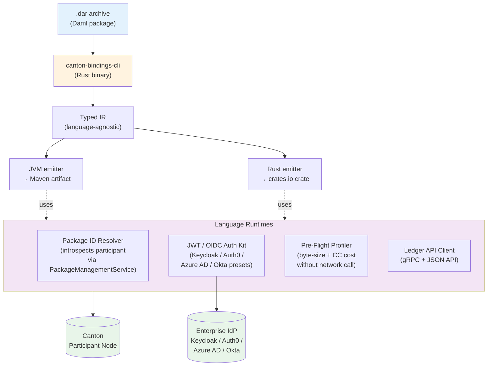
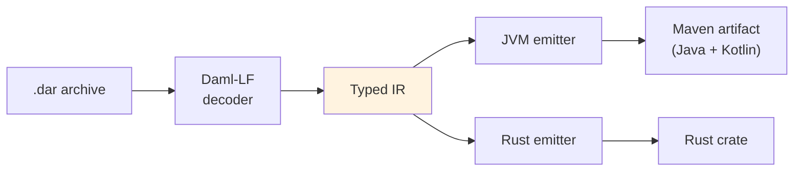
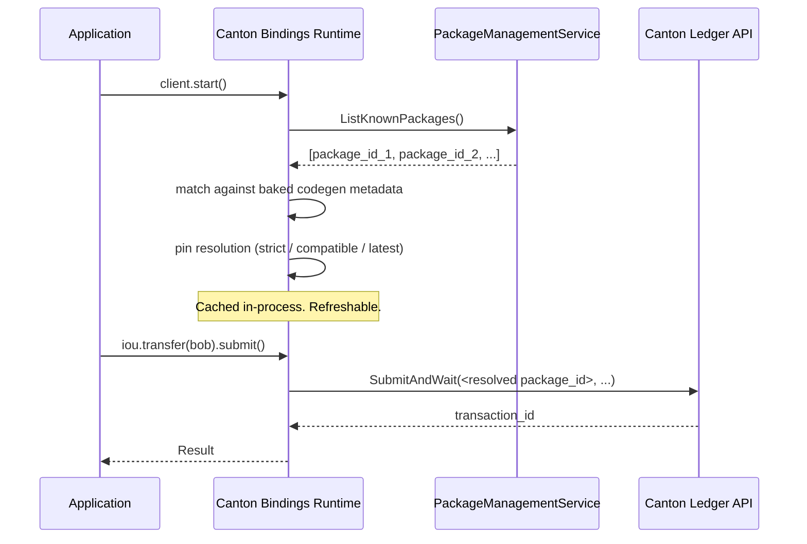
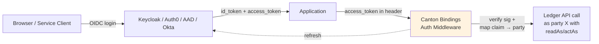
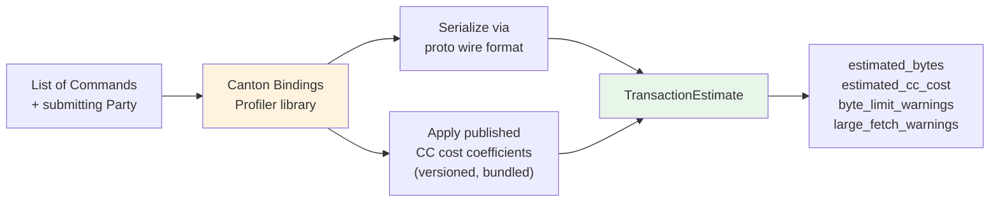
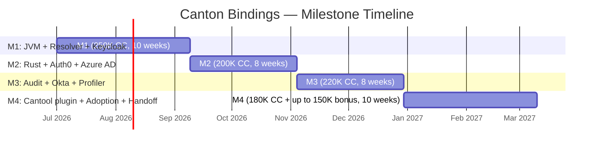

# Canton Bindings

**Production-grade Java/Kotlin and Rust client SDKs for the Canton Network, with a JWT/OIDC auth toolkit and a pre-flight transaction cost profiler.**

[](LICENSE)
[](https://github.com/canton-foundation/canton-dev-fund/pulls)
[](https://github.com/canton-foundation/canton-dev-fund)
[](https://forum.canton.network/t/rfc-canton-bindings-multi-language-sdks-jwt-oidc-pre-flight-profiler/8668)
[](https://lists.sync.global/g/grants-discuss/topic/rfc_canton_bindings/119439952)

> Building the runtime layer for the 83% of Canton developers who identify as TradFi or Hybrid.
> Active Canton Development Fund proposal — review, feedback, and collaboration invited.

---

## TL;DR

Canton Bindings ships **three things** the Foundation's Q1 2026 Developer Experience Survey explicitly called out as missing, and that no current Dev Fund proposal addresses:

1. **Typed Java/Kotlin and Rust client SDKs** with a runtime Package ID Resolver that eliminates the "spend days hardcoding `.dar` hashes" pain.
2. **A JWT/OIDC authentication toolkit** with first-class presets for Keycloak, Auth0, Azure AD, and Okta — the four IdPs that cover the majority enterprise share.
3. **A Pre-Flight cost profiler** so developers stop "deploying blindly."

The scope is **deliberately complementary** to every funded direction in the canton-dev-fund pipeline. We do not propose TypeScript (covered by Digital Asset), Go (covered by Noders LLC), Python (DAZL exists), or C#/.NET (covered by Peaceful Studio). Canton Bindings fills the empty quadrant of the Canton language matrix: JVM and Rust on the server / service side, with cross-cutting auth and cost-estimation infrastructure.

---

## Table of contents

- [Why this exists](#why-this-exists)
- [Scope](#scope)
- [What's NOT in scope (and why)](#whats-not-in-scope-and-why)
- [Architecture](#architecture)
- [What the SDK looks like](#what-the-sdk-looks-like)
- [Roadmap and milestones](#roadmap-and-milestones)
- [Security model](#security-model)
- [Funding](#funding)
- [Team](#team)
- [How to engage](#how-to-engage)
- [References](#references)
- [License](#license)

---

## Why this exists

The Foundation's [Q1 2026 Developer Experience and Tooling Survey](https://forum.canton.network/t/canton-network-developer-experience-and-tooling-survey-analysis-2026/8412) (41 active developers) identified three friction points by name, drawn directly from the report:

> **"Typed Client SDK & Code Generator:** Developers currently spend days manually extracting hash strings from compiled files (.dar) and hardcoding them into their frontends. They also struggle significantly with implementing JWT authentication middleware, which is a repeated friction point for **'Hybrid' and 'TradFi' teams**."

> **"Pre-Flight Resource & Cost Profiler:** Developers often deploy 'blindly,' only discovering that their transactions are too large (hitting byte-size limits) or too expensive after they fail in a testnet or production environment."

The institutional cohort behind 83% of Canton survey respondents — TradFi and Hybrid teams — runs the JVM. DTCC, Goldman Sachs, HSBC, BNY Mellon, Visa, Broadridge, and the rest of the institutional super-validator and dApp landscape ship production services in Java and Kotlin. Today, when those teams ship a Canton workload, they either rebuild low-level gRPC client wiring per project or wait for an SDK that does not exist.

Canton Bindings closes that gap.

---

## Scope

| Component | Description |
|---|---|
| **`canton-bindings-cli`** | Rust binary consuming `.dar` archives and emitting typed client code via a language-agnostic Typed IR |
| **JVM runtime** (Maven Central) | Idiomatic Java + Kotlin client. Coroutines support. Spring Boot autoconfiguration. Ktor module |
| **Rust runtime** (crates.io) | `tokio`-native async surface. `prost`-based protobuf decoding |
| **Runtime Package ID Resolver** | Auto-pins package IDs against `PackageManagementService` at startup. Eliminates hardcoded `.dar` hashes. Configurable policy: `strict` / `compatible` / `latest` |
| **JWT/OIDC Auth Kit** | Per-language middleware with first-class presets for Keycloak, Auth0, Azure AD, and Okta. Configurable claim-to-party mapping |
| **Pre-Flight Profiler** | Pure-function library returning byte-size and Canton Coin cost estimates without a network call |
| **Cantool plugin** | `cantool bindings gen <lang>` and `cantool bindings profile`. Zero changes required to Cantool core |

All artifacts: **Apache-2.0** licensed.

---

## What's NOT in scope (and why)

We read every open and merged Dev Fund proposal before scoping this work. The scope is the empty quadrant.

| Existing proposal | Lane | Why we don't overlap |
|---|---|---|
| [Digital Asset — Canton Network dApp SDK and Tooling](https://github.com/canton-foundation/canton-dev-fund/blob/main/proposals/2026-03-DA-Canton-Network-dapp-sdk-and-tooling.md) | TypeScript dApp SDK, CIP-0103 wallet connectivity, WalletConnect, Wallet Discovery | We do not ship a TypeScript SDK. JVM and Rust only. |
| [Noders LLC — Go SDKs](https://github.com/canton-foundation/canton-dev-fund/blob/main/proposals/2026-03-Noders%20LLC-go-sdks.md) | `go-daml`, `go-wallet-daml`, DAZL upstream PRs | We do not ship Go bindings. We do not ship Python bindings — Noders' DAZL contributions remain the canonical Python path. |
| [Peaceful Studio — C#/.NET SDK](https://github.com/canton-foundation/canton-dev-fund/blob/main/proposals/2026-03-Peaceful%20Studio-csharp-dotnet-sdk.md) | C#/.NET SDK | We do not ship C#/.NET bindings. |
| [Cantool](https://github.com/canton-foundation/canton-dev-fund/blob/main/proposals/2026-03-CCTools-cctools.md) | Local dev loop CLI | Milestone 4 ships a `cantool-bindings` plugin. Complementary, not competitive. |
| BitDynamics DevKit, Denex LocalNet | Local environment lifecycle | Out of scope. Canton Bindings runs on top of any local environment the developer chooses. |
| CantonTrace, PartyLayer, Wallet Gateway | Runtime debugging, end-user wallet UX, signing services | Out of scope. We sit on the server / service side. |
| Kaiko Data Standard | DAML interface for on-ledger data | Orthogonal. Canton Bindings consumers can use Kaiko-standard data points like any other ledger contract. |

---

## Architecture

### System overview



### Codegen pipeline



The IR layer is the key design decision: it lets each emitter ship ergonomic code (Kotlin sealed classes for choice variants, Rust `enum`s with discriminant matching) rather than a lowest-common-denominator translation. Adding a future language (e.g. Swift, Erlang) requires only a new emitter, not changes to the codegen front-end.

### Runtime Package ID Resolver



### JWT/OIDC authentication flow



The middleware ships JWK fetching over TLS, signature verification via well-audited per-language libraries (`nimbus-jose-jwt` for JVM, `jsonwebtoken` for Rust), configurable claim-to-party mapping (e.g. `email → party`, `groups[] → readAs/actAs`), and token refresh. The four IdP presets cover the dominant enterprise share.

### Pre-Flight Profiler



Pure function. No network call. Cost coefficients bundled at compile time — remote configuration is explicitly out of scope to prevent supply-chain attacks against cost estimation.

---

## What the SDK looks like

> These are design examples illustrating the intended API surface. Final API may evolve based on community input on the [grants-discuss thread](https://lists.sync.global/g/grants-discuss/topic/rfc_canton_bindings/119439952) and [forum RFC](https://forum.canton.network/t/rfc-canton-bindings-multi-language-sdks-jwt-oidc-pre-flight-profiler/8668).

### Java — Spring Boot service with Keycloak auth and pre-flight cost check

```java
@RestController
public class TransferController {

    private final CantonClient client;
    private final Profiler profiler;

    public TransferController(CantonClient client, Profiler profiler) {
        this.client = client;
        this.profiler = profiler;
    }

    @PostMapping("/transfer")
    public ResponseEntity<TransferResult> transfer(
            @AuthenticationPrincipal CantonPrincipal user,
            @RequestBody TransferRequest req) {

        Iou.ContractId iou = Iou.ContractId.fromString(req.iouId());

        // Pre-flight check before submission
        var estimate = profiler.estimate(iou.exerciseTransfer(req.to()));
        if (estimate.estimatedCcCost().compareTo(req.maxCost()) > 0) {
            return ResponseEntity.badRequest()
                .body(new TransferResult("estimated cost exceeds budget"));
        }

        // Submit as the authenticated party
        var txId = client.asParty(user.party())
            .submitAndWait(iou.exerciseTransfer(req.to()));

        return ResponseEntity.ok(new TransferResult(txId));
    }
}
```

```yaml
# application.yml
canton:
  participant:
    url: https://participant.example.com:6865
  auth:
    provider: keycloak
    issuer: https://keycloak.example.com/realms/canton
    claim-mapping:
      party: email
      read-as: groups
  resolver:
    policy: strict   # exact, compatible, latest
    refresh: on-package-upgrade
```

### Kotlin — coroutines-native, idiomatic

```kotlin
suspend fun executeTransfer(
    client: CantonClient,
    iouId: Iou.ContractId,
    bob: Party,
    budgetCC: BigDecimal,
): TransferResult {
    val command = iouId.exerciseTransfer(bob)

    val estimate = client.profiler.estimate(command)
    require(estimate.estimatedCcCost <= budgetCC) {
        "Estimated cost ${estimate.estimatedCcCost} CC exceeds budget $budgetCC CC"
    }

    return client.submitAndWait(command)
}
```

### Rust — `tokio`-native, with `axum`/`actix` integration

```rust
use canton_bindings::{CantonClient, KeycloakAuth, PackageResolver};
use canton_bindings::profiler::Profiler;

let client = CantonClient::builder()
    .ledger_url("https://participant.example.com:6865")
    .auth(KeycloakAuth::from_env()?)
    .resolver(PackageResolver::strict())
    .build()
    .await?;

let transfer = iou.exercise_transfer(&bob)?;

let estimate = client.profiler().estimate(&[transfer.clone()]).await?;
anyhow::ensure!(
    estimate.estimated_cc_cost < 1.0,
    "Estimated cost {} CC too high",
    estimate.estimated_cc_cost
);

let tx_id = client.as_party(&alice).submit_and_wait(&[transfer]).await?;
println!("Transferred: {}", tx_id);
```

### What "10 minutes from zero to first transaction" means

```bash
# 1. Add the dependency
mvn dependency:add -Dartifact=io.cantonbindings:runtime-jvm:0.1.0
mvn dependency:add -Dartifact=io.cantonbindings:auth-jvm-keycloak:0.1.0

# 2. Generate typed bindings from your .dar
canton-bindings-cli gen jvm \
    --dar ./daml/iou-0.0.1.dar \
    --output ./src/main/java

# 3. Configure (application.yml above)

# 4. Spring Boot autoconfiguration handles the rest
mvn spring-boot:run
```

---

## Roadmap and milestones

Approximately 36 weeks (8.3 months) from grant approval. Total ask: **850,000 CC fixed + up to 150,000 CC adoption bonus**.



| Milestone | Focus | Weeks | Fixed | Adoption bonus |
|---|---|---|---|---|
| **M1** | Java/Kotlin SDK, Maven Central artifacts, Runtime Resolver, Keycloak auth preset, Spring Boot demo against `cn-quickstart` LocalNet | 10 | 250,000 CC | — |
| **M2** | Rust SDK on crates.io, Auth0 preset, Azure AD preset (verified against live tenants), Actix demo | 8 | 200,000 CC | — |
| **M3** | Third-party security audit (vendor: Cure53 / Trail of Bits class), Okta preset, Pre-Flight Profiler library, audit remediation | 8 | 220,000 CC | — |
| **M4** | `cantool-bindings` plugin, full Docusaurus docs site, 2 end-to-end tutorials, 2 HackTour India workshops, maintainer handoff | 10 | 180,000 CC | up to **150,000 CC** (25K × up to 6 production adopters) |

Adoption-tied bonus structure follows precedent set by [Kaiko's Data Standard proposal](https://github.com/canton-foundation/canton-dev-fund/blob/main/proposals/2026-05-Kaiko-data-standard.md). Foundation pays for ecosystem outcomes, not just artifacts.

Acceleration bonus (+5% on M4) and late penalty (-5% per 30 days, capped at 20% per milestone) follow Digital Asset's pattern.

---

## Security model

The proposal includes a dedicated audit milestone (M3) with a third-party vendor (Cure53 / Trail of Bits class). Audit scope agreed with the Foundation Security Subcommittee and published before audit begins.

| Component | Surface | Posture |
|---|---|---|
| **JWT/OIDC Auth Middleware** | Token verification, claim mapping, refresh | All signature verification uses well-audited per-language libraries (`nimbus-jose-jwt` JVM, `jsonwebtoken` Rust). JWKs fetched over TLS with bounded cache. `aud` claim pinning prevents cross-service replay. `readAs`/`actAs` claims validated against explicit allowlist. |
| **Runtime Package ID Resolver** | Participant introspection, package pinning | Resolver introspects only via official `PackageManagementService` over authenticated channel. Package fingerprints baked at codegen time enable post-resolution validation. Default policy is `strict` pinning. `compatible` and `latest` policies require explicit opt-in. |
| **Pre-Flight Profiler** | Cost estimation | Pure function, no network calls during estimation. Cost coefficients loaded from versioned, bundled source. Remote config explicitly out of scope. |
| **Supply chain** | Published artifacts | Maven Central / crates.io trusted-publisher mechanisms. Codegen output includes provenance trail referencing source `.dar` and CLI version. |

---

## Funding

**Total requested:** 850,000 CC fixed + up to 150,000 CC adoption-tied bonus = up to **1,000,000 CC maximum**.

Anchored in a defensible middle of the funded landscape:

| Proposal | Total | Notes |
|---|---|---|
| Axcess (private credit app) | 318K CC | Single-author single-application — below our scope |
| **Canton Bindings (this proposal)** | **850K CC + up to 150K bonus** | Multi-language infrastructure + audit |
| x402 Protocol Integration (FTP) | 1M CC | Wraps pre-existing production product |
| Kaiko Data Standard | 1.3M CC + adoption bonus | Adoption-tied precedent |
| Noders LLC Go SDKs | 2.26M CC | Includes retroactive funding for delivered work |
| Digital Asset dApp SDK | 8.17M CC | Spans wallet+dApp connectivity layer + audits |

Per CIP-0100, as the project extends beyond 6 months, the grant is denominated in fixed Canton Coin with a formal re-evaluation at the 6-month mark. The proposer assumes price volatility risk between milestones, consistent with the pattern set by Digital Asset's dApp SDK proposal.

Full milestone-by-milestone deliverables and acceptance criteria live in the [Dev Fund PR proposal file](https://github.com/canton-foundation/canton-dev-fund/blob/main/proposals/2026-05-HackTourIndia-canton-bindings.md).

---

## Team

**Jatin Sahijwani** and **Anirudh Singh**, co-founders of **HackTour India** ([x.com/HackTourIND](https://x.com/HackTourIND)) — a Web3 developer community that ran **50+ events across India in 2025**.

### Prior foundation-funded SDK delivery

The closest available proxies for our ability to deliver Canton Bindings are two previous developer SDKs we have shipped under foundation grant programs.

| Grant | Deliverable | Why it maps to Canton Bindings |
|---|---|---|
| **Arbitrum Foundation** | Production-grade ZK SDK for Arbitrum. TypeScript, end-to-end Circom-to-verifier-contract pipeline, single-call JS integration that abstracts the entire Web3 surface | Structurally identical to this proposal — a typed SDK that turns a heavy crypto-native artifact (`.circom` there, `.dar` here) into a one-call integration for application developers across an ecosystem with a steep learning curve |
| **Avalanche Team1 (mini-grant)** | ZK SDK for Avalanche subnets | Demonstrates repeated capacity to ship developer infrastructure across heterogeneous L1 architectures |

Plus **15+ hackathon wins** across EthIndia, ETHGlobal, Polkadot AssetHub, Avalanche, Arbitrum, Rootstock, Oasis, Nillion, and others — including 1st prize at EthIndia 2025, 1st prize at Polkadot AssetHub Hackathon, 1st prize at Graph-e-thon (IoT + AI/ML medical infrastructure), 2nd prize at Avalanche Team1 Delhi, and Rootstock Infrastructure track at ETHGlobal New Delhi.

### On the Daml/Canton ramp

We are new to Daml/Canton, deliberately. The Foundation's Q1 2026 survey shows **71% of Canton developers come from an EVM background** and **80% joined in the last 12 months** — we are exactly that demographic. Every Daml/Canton onboarding friction point we hit in real time as we build will be calibrated into the SDK's ergonomics, against fresh and honest user experience rather than against years of accumulated Daml intuition.

Mitigation is concrete:
- 2-week dedicated Daml/Canton ramp at the front of M1 (cn-quickstart, Daml SDK, Splice LocalNet)
- Prior-art absorption: reading the source of Cantool, `daml codegen js`, Noders' `go-daml`, and the Splice Scan API before architecting the IR layer
- Friendly engagement with adjacent maintainers — Eric Mann (Cantool) and the `daml codegen js` maintainers at Digital Asset — to turn potential overlap into explicit collaboration
- M1 ships TypeScript-adjacent JVM work first (where we have deepest expertise) before Rust. If the ramp goes badly, the Committee sees it in M1 and can intervene before larger sums commit.

### Why distribution is a deliverable, not an afterthought

CIP-0082 explicitly lists *"Inclusion of GTM and distribution plans"* as an evaluation criterion. Most grant teams have nothing here. HackTour India is a built-in, EVM-flavoured Indian developer community of exactly the kind of builders the Foundation wants Canton to attract. M4 commits to two hands-on workshops integrated into HackTour India's 2026 calendar.

---

## How to engage

We are actively seeking input. Four channels:

| Channel | When to use it |
|---|---|
| **[Canton Forum RFC](https://forum.canton.network/t/rfc-canton-bindings-multi-language-sdks-jwt-oidc-pre-flight-profiler/8668)** | Public technical discussion, ergonomic feedback, API shape input |
| **[grants-discuss mailing list](https://lists.sync.global/g/grants-discuss/topic/rfc_canton_bindings/119439952)** | Foundation-wide community discussion on scope and milestone sizing |
| **GitHub Issues on this repo** | Targeted bug reports, design suggestions, prior-art links |
| **Dev Fund PR comments** | Formal review, Committee evaluation, SIG feedback |

We particularly value input from members of the following SIGs:

- **Daml Language & Developer Tooling** (`@nycnewman`, `@v9n`, `@srikanth-bitdynamics`, `@Andrew-Pohl`, `@LimKianAn`)
- **DAR Package Management & App Lifecycle** (`@nycnewman`, `@zheli`, `@akshaysinha100`)
- **Canton APIs (Ledger API, SQL API, Admin API)** (`@mgaare`, `@akashgaurav`)
- **dApp Integration** (`@0xbigboss`, `@mgaare`, `@v9n`, `@mjuchli-da`, `@PHOL-DA`, `@joel-da`)

If you are building a TradFi/Hybrid service on Canton in JVM or Rust, or are considering one, we would specifically love to hear:

1. Which IdP do you run? (Helps us prioritize beyond Keycloak/Auth0/AAD/Okta if needed)
2. What's the largest pain point your current Canton client wiring has?
3. Would adoption-tied funding (Foundation pays per real adopter) make our proposal more or less attractive to fund?

---

## References

- [Canton Foundation Grants Program](https://canton.foundation/grants-program/)
- [CIP-0082 — Establish a 5% Development Fund](https://github.com/canton-foundation/cips/blob/main/cip-0082/cip-0082.md)
- [CIP-0100 — Governance & Review Process](https://github.com/canton-foundation/cips/blob/main/cip-0100/cip-0100.md)
- [Canton Q1 2026 Developer Experience and Tooling Survey Analysis](https://forum.canton.network/t/canton-network-developer-experience-and-tooling-survey-analysis-2026/8412)
- [Foundation SIG Directory](https://github.com/canton-foundation/canton-dev-fund/blob/main/sig-directory.md)
- [Splice Scan API](https://docs.dev.sync.global/app_dev/scan_api/index.html)
- [cn-quickstart (Digital Asset)](https://github.com/digital-asset/cn-quickstart)

---

## License

Source code in this repository (when implementation begins) will be released under the [Apache License 2.0](LICENSE).

This proposal document is dedicated to the public domain under [CC0-1.0](https://creativecommons.org/publicdomain/zero/1.0/), in line with the `canton-foundation/canton-dev-fund` repository policy.

---

*Canton Bindings is an active Canton Development Fund proposal by [HackTour India](https://x.com/HackTourIND). Last updated: 2026-05-31.*
